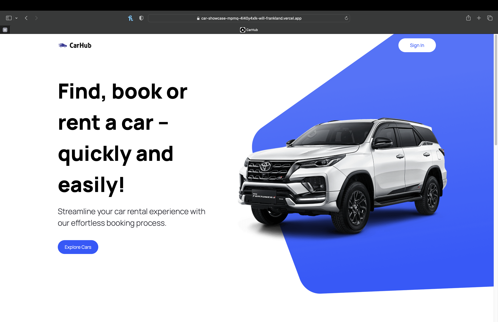
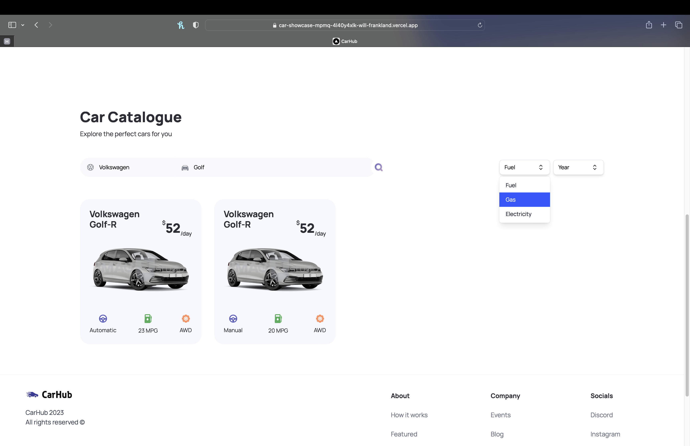
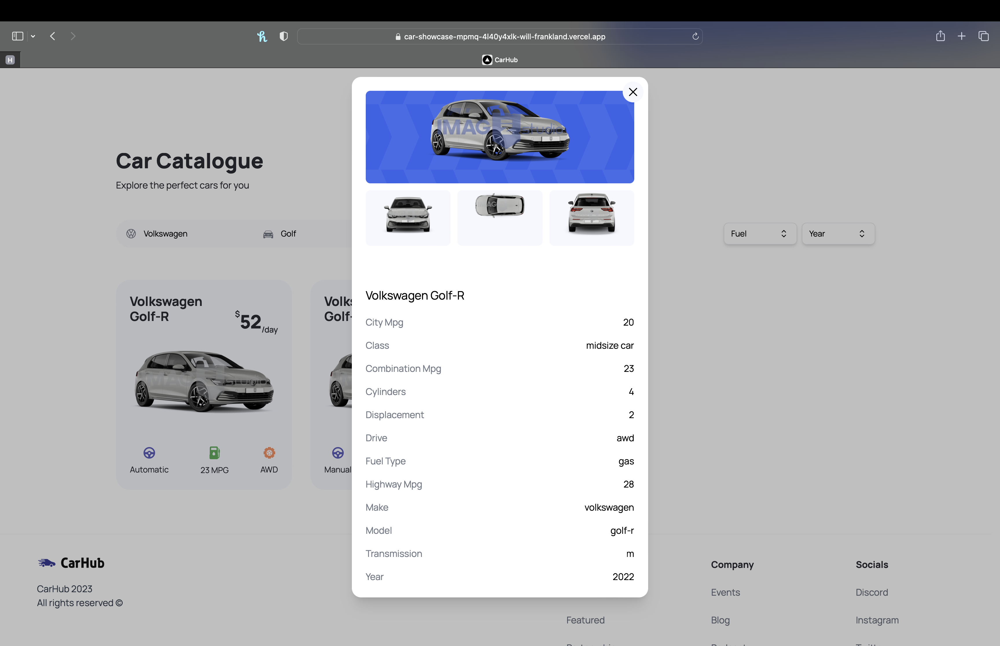

## About this app

This app is a car rental website that utilizes API calls to gather car information such as make, model, fuel type, AWD/FWD/RWD data, MPG and transmission type.

It was built using NextJs, TypeScript, TailwindCSS, HeadlessUI and displays a variety of different components such as search functionality, filtering by year and fuel type, pagination and utilizing a modal to display additional car information.

### Functionality & Key Features

The site is fully adjustable for screen sizes ranging from mobile to desktop.

I followed a tutorial created by JavaScriptMastery to become more proficient with TypeScript and NextJs, learn more key principles and best practices in order to expand my portfolio.

The CarHub app has been deployed on Vercel can be viewed here:

https://car-showcase-mpmq-4l40y4xlk-will-frankland.vercel.app/?model=m3&manufacturer=bmw

## Tech Stack

- NextJs
- TypeScript
- TailwindCSS
- HeadlessUI
- HTML
- CSS

## Screenshots

## Dependencies

- HeadlessUI

# Getting Started

## Available Scripts

In the project directory, you can run:

### `npm  i`
### `npm  run dev`

Runs the app in the development mode.\
Open [http://localhost:3000](http://localhost:3000) to view it in your browser.

The page will reload when you make changes.\